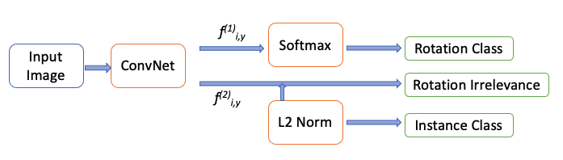

## *Self-Supervised Representation Learning by Imbalanced Rotation Feature Decoupling*

### Introduction

This repository is an implementation of "Self-Supervised Representation Learning by Rotation Feature Decoupling" with Label-Distribution Aware Magin Loss to account for long-tailed real-world datasets.

**Abstract:**  
Self-supervised learning aims to learn the features without using manual annotations. This unsupervised visual representation learning is improving faster and closing the performance gap with supervised methods. Besides, this task generalization helps achieve a  robust model on a  particular primary task. It helps in learning a rich feature representation that can be used to learn the downstream tasks.  The existing approaches often follow supervised learning to learn a generalized model, which usually requires a broad set of labeled data that is not available for many real-world problems. Also, a choice of pretext tasks for self-supervised representation learning plays an important role. In the existing work, rotation pretext tasks are chosen, given its ease, if used in any problem setting and well studied visual representation properties. We were here training the neural network to predict the image rotations and distinguish the image instances. While learning the representation, the model also decouples the instance classification and rotation classification. However, these experiments don't consider an imbalance in the classes and an imbalance between the rotation agnostic images and rotatable images. To this end, in this work, we proposed to leverage label-distribution-aware margin (LDAM, a class-dependent loss) and deferred reweighting  (DRW)  technique to account for the imbalance. This would help make the model more robust to imbalanced samples and useful in downstream task applications using the feature presentation learned via self-supervised learning. 

### Illustration

### Notice

* Inside the [FeatureDecoupling](https://github.com/philiptheother/FeatureDecoupling) directory with the downloaded code, the experiments-related data will be stored in the directories [_experiments](https://github.com/philiptheother/FeatureDecoupling/tree/master/_experiments) and [_experiments_conversion](https://github.com/philiptheother/FeatureDecoupling/tree/master/_experiments_conversion).

* You have to make a copy of the file [config_env_example.py](https://github.com/philiptheother/FeatureDecoupling/blob/master/config_env_example.py) and rename it as *config_env.py*. Set in *config_env.py* the paths to where the caffe directory and datasets reside in your machine. 

### Experiments

* In order to train a FeatureDecoupling model in an unsupervised way with AlexNet-like architecture on the ImageNet training images and then evaluate linear classifiers (for ImageNet and Places205) as well as non-linear classifiers (for ImageNet) on top of the learned features please visit the [pytorch_feature_decoupling](https://github.com/philiptheother/FeatureDecoupling/tree/master/pytorch_feature_decoupling) folder.

* For PASCAL VOC 2007 detection task please visit the [caffe_voc_detection](https://github.com/philiptheother/FeatureDecoupling/tree/master/caffe_voc_detection) folder.

### Download the already trained FeatureDecoupling model

* In order to download the FeatureDecoupling model (with AlexNet architecture) trained on the ImageNet training set, go to: [ImageNet_Decoupling_AlexNet](https://mega.nz/#!Wmh3WIDZ!e2TgkXEsMMpZNZvb1Tp8HsdBfeZOA3WKn5g0AkXEwAA). Note that:   
  1. The model is saved in pytorch format.
  2. It expects RGB images that their pixel values are normalized with the following mean RGB values `mean_rgb = [0.485, 0.456, 0.406]` and std RGB values `std_rgb = [0.229, 0.224, 0.225]`. Prior to normalization the range of the image values must be [0.0, 1.0].

 * In order to download the FeatureDecoupling model (with AlexNet architecture) trained on the ImageNet training set and convered in caffe format for PASCAL VOC 2007 classification and detection, go to: [ImageNet_Decoupling_AlexNet_caffe_cls](https://mega.nz/#!e65D3CLZ!jUvWfBt3NBcjZSI90X5mKKe-OHSswN9nWo_aPo1YCOQ). Note that:   
   1. The model is saved in caffe format.
   2. It expects RGB images that their pixel values are normalized with the following mean RGB values `mean_rgb = [0.485, 0.456, 0.406]` and std RGB values `std_rgb = [0.229, 0.224, 0.225]`. Prior to normalization the range of the image values must be [0.0, 1.0].
   3. The weights of the model are rescaled with the approach of [Kr&auml;henb&uuml;hl et al, ICLR 2016](https://github.com/philkr/magic_init).

### To do

* Troubleshooting
* Check with ImageNet
